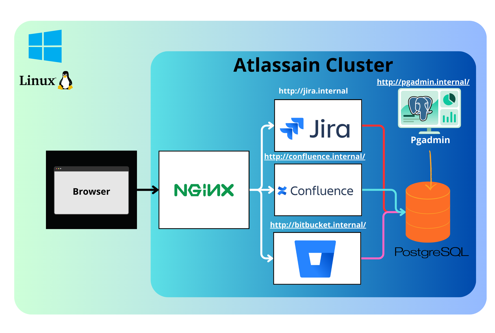

# Atlassian Server Product Docker Installation Script

This script automates the installation of Atlassian Server products (Jira, Confluence, and Bitbucket) using Docker Compose. The script also handles the installation of Docker and Docker Compose if not already installed on the system.


## Architecture




## Author

- Author: Anouar Harrou

## Features

- 🚀 Easy installation and configuration of Atlassian Server products.
- 🐳 Automatic installation of Docker and Docker Compose.
- 💡 Provides a simple interactive prompt for user confirmation.

## Prerequisites

Make sure your system meets the following requirements:

- 🐧 Ubuntu Server or CentOS 7.
- 🖥️ Docker Desktop on windows.
- 🐚 Bash shell.
- 🌐 Internet connection for downloading Docker and Docker Compose.

## System Requirements

Ensure your system has the following resources:

- **Memory:** At least 4GB RAM (8GB or more recommended) 🧠.
- **Storage:** Sufficient disk space for Docker images and Atlassian product data 📦.
- **CPU:** Multi-core processor (Quad-core or higher recommended) 💻.

## Usage

1. **Clone this repository:**

    ```bash
    git clone https://github.com/yourusername/atlassian-docker-script.git
    ```

2. **Navigate to the script directory:**

    ```bash
    cd atlassian-docker-script
    ```

3. **Make the script executable:**

    ```bash
    chmod +x atlassian-server-setup.sh
    ```

4. **Run the script:**

    ```bash
    ./atlassian-server-setup.sh
    ```

5. **Note for Windows Users:**

    If you're running Docker Desktop on Windows, add the following lines to `C:\Windows\System32\drivers\etc\hosts`:

    ```plaintext
    127.0.0.1 jira.internal
    127.0.0.1 confluence.internal
    127.0.0.1 bitbucket.internal
    127.0.0.1 postgres.internal
    ```

    After that, go to `./docker` and run:

    ```bash
    docker-compose -p Atlassian_Server up -d
    ```

6. **Follow the prompts to continue with the installation.**

## Supported Platforms

- 🌐 Ubuntu Server
- 🐧 CentOS 7
- 🖥️ Windows

## License

This project is licensed under the GNU AFFERO GENERAL PUBLIC LICENSE - see the [LICENSE](LICENSE) file for details.

## Acknowledgments

- Inspired by the need for a quick and automated setup of Atlassian Server products.

---

**Note:** Always ensure your system meets the specified requirements in terms of memory, storage, and CPU before running the script on a production environment. 🚀
